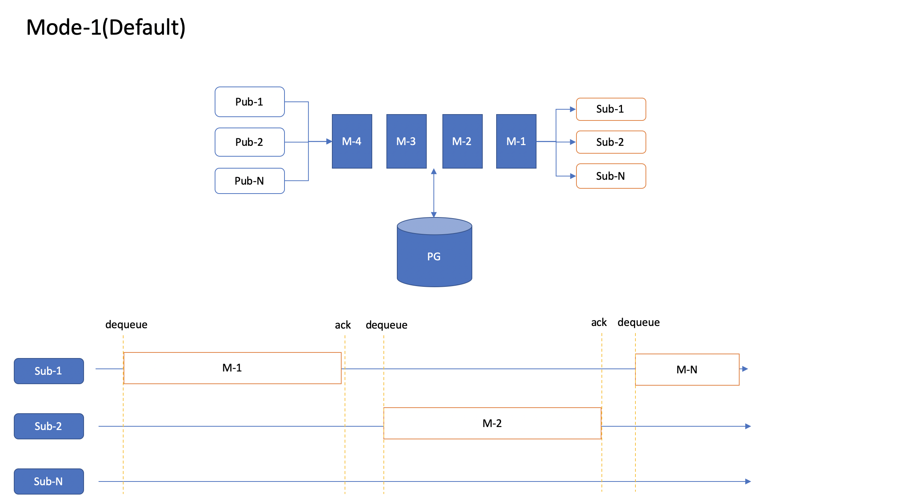

# pg-que

This package is a simple queue implementation for postgres which can be used with horizontally scaled microservices. and provides following features
1. Multiple Publishers with Multiple Subscribers but Sequential Execution with Message Acks and Timeouts.
3. Message persistency.
2. Can be used with H-Scaled services or with mutiple threads within a single process.

## Getting Started

1. Install using `npm i pg-que`
2. Require in your project. `const QType = require('pg-que');`
3. Run postgres as local docker if required. `docker run --name pg-12.4 -e POSTGRES_PASSWORD=mysecretpassword -e POSTGRES_DB=pg-queue -p 5432:5432 -d postgres:12.4-alpine`
4. Instantiate with a postgres readers and writers connection details. 
5. All done, Start using it!!.

## Examples/Code snippets

A complete example can be found at [here](https://raw.githubusercontent.com/LRagji/pg-queue/master/examples/default.js)

1. **Initialize**
```javascript
const QType = require('pg-que');
const pgp = require('pg-promise')();
pgp.pg.types.setTypeParser(20, BigInt); // This is for serialization bug of BigInts as strings.
pgp.pg.types.setTypeParser(1114, str => str); // UTC Timestamp Formatting Bug, 1114 is OID for timestamp in Postgres.
const defaultConectionString = "postgres://postgres:@localhost:5432/pg-queue";
const readConfigParams = {
    connectionString: defaultConectionString,
    application_name: "Queue-Reader",
    max: 4 //4 readers
};
const writeConfigParams = {
    connectionString: defaultConectionString,
    application_name: "Queue-Writer",
    max: 2 //2 Writer
};
const Qname = "Laukik";
const Q = new QType(Qname, pgp(readConfigParams), pgp(writeConfigParams));
```

2. **Enqueue**
```javascript
await Q.enque([1,2,3,4,5].map(e)=>({"Counter":e}));
```
3. **Dequeue**
```javascript
const payload = await Q.tryDeque();
```
4. **Acknowledge**
```javascript
const payload = await Q.tryDeque();
const acked = await Q.tryAcknowledge(payload.AckToken);
console.log(acked);
```

## Theory

### *Why build one when there are tons of options avaialble for distributed queue?*
Yes, there are N options available for queues, eg: RabbitMQ, Redis Streams, Kafka etc, but they all are different systems, which means application has to maintain sync between them and cater to failure modes for system being different. There was a need for one stop solution for all these common scenarios of applications and thus this package came into existence.

### *Can this be adopted to different languages?*
Yes, it uses concepts which are PG based and not language specific so yes a port is possible.

### *What core concepts have been used?*
1. **SERIALIZABLE Transactions**: This is a transaction mode in PG, used to make sure only one subscriber get into the que at a time.
2. **Cursors**: Each subscriber maintains a cursor of what was read by it, it will not increment until ack has been received for the same.
3. **Acknowledgements**: Each message once read can be marked as completed and done with acks, this helps to confirm consumptions on the subscriber side and for cursor to move ahead.
4. **Timeouts**: if a subscriber acquires a message and then abprutly dies. The same message can be picked up by other subscriber after a certain timeout.

### *What different modes are supported?*
Mode 1: Simple Que with multiple publishers and multiple subscribers and messages getting sequentially executed between them, as shown below , more modes may land in future.



## Built with

1. Authors :heart: love :heart: for Open Source.
2. [pg-promise](https://www.npmjs.com/package/pg-promise).
3. [pg-boot](https://www.npmjs.com/package/pg-boot)

## Contributions

1. New ideas/techniques are welcomed.
2. Raise a Pull Request.

## Current Version:
0.0.7[Beta]

## Known issues
1. Type parsers for pg has to be set inside the package, but this cant be done as it will override the connection object settings, this is a singleton issue highlighted [here](https://github.com/brianc/node-postgres/issues/2363) and awaiting fix for it.

## License

This project is contrubution to public domain and completely free for use, view [LICENSE.md](/license.md) file for details.

## Change Log
1. Id generated by the system for each message now has "Page"=>P rather than "Timestamp"=>T. tryDeque API
2. System expects JSON to be passed as payload doesnot do any internal formatting. enque API
3. Constructor now expects number of pages instead of clean up after as last parameter. constructor API
4. Design concept changes Q is now based on circular buffer as this is easy on MVCC pattern of postgres reduces table and index bloat.
